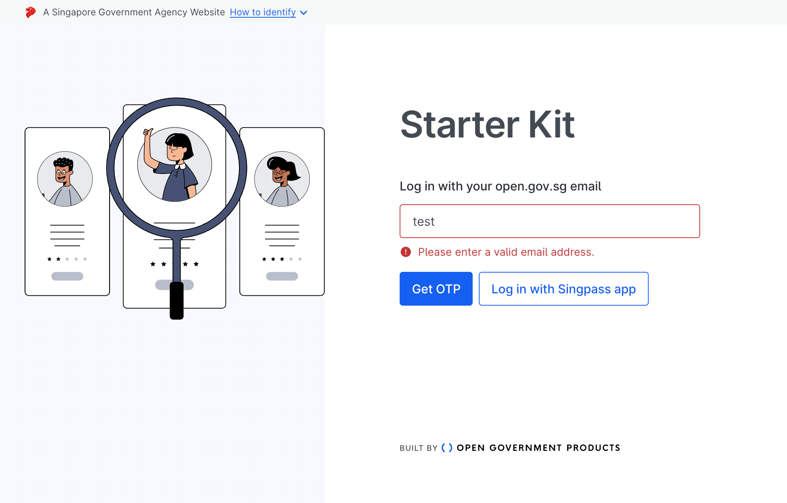

# Storybook

Storybook is a tool for for building UI components and pages in isolation. It streamlines UI development, testing, and documentation.

By building UI components and pages in isolation, you can:

- Validate components and pages without needing to navigate to a specific page or state in your application
- Test UI components and pages in isolation
- Document UI components and pages in isolation

:::info
Storybook themselves have a great primer on [what Storybook is](https://storybook.js.org/docs/react/get-started/whats-a-story) and [why you should use it](https://storybook.js.org/docs/react/workflows/why-storybook).
:::

## Running Storybook

The application has been set up with Storybook. You can run Storybook with:

```sh
npm run storybook
```

The command will start Storybook on `localhost:6006`, where you can see the current stories already written as examples.

## Writing stories

For more in-depth information on how to write stories, refer to the [Storybook documentation on how to write stories](https://storybook.js.org/docs/react/writing-stories/introduction).

In addition, here are some current examples in the application that you can refer to:
| File | Description |
| --- | --- |
| [src/stories/Page/SignInPage.stories.ts](https://github.com/opengovsg/starter-kit/blob/develop/src/stories/Page/SignInPage.stories.ts) | Example of a page story |
| TODO | Example of a component story |

From the above examples, there are a few important parts to a good story:

### File name of stories

The default configuration (found in [`.storybook/main.ts`](https://github.com/opengovsg/starter-kit/blob/develop/.storybook/main.ts)) looks for files with the following glob pattern:

```ts
const config = {
  stories: ["../src/**/*.mdx", "../src/**/*.stories.@(js|jsx|ts|tsx)"],
};
```

### Component Story Format (CSF)

Stories are written according to the [Component Story Format](https://storybook.js.org/docs/react/api/csf) (CSF), an ES6 module-based standard that is easy to write and portable between tools.

The key ingredients are the default export that describes the component, and named exports that describe the stories.

#### Default export

The `default` export metadata controls how Storybook lists your stories and provides information used by addons. For example, here’s the default export for the story file SignInPage.stories.ts:

```tsx title="SignInPage.stories.ts|tsx"
import type { Meta } from "@storybook/react";
import SignInPage from "~/pages/sign-in";

const meta: Meta<typeof SignInPage> = {
  /* 👇 The title prop is optional.
   * See https://storybook.js.org/docs/react/configure/overview#configure-story-loading
   * to learn how to generate automatic titles
   */
  title: "Pages/Sign In Page",
  component: SignInPage,
  parameters: {
    // Will be elaborated upon later
    // ...
  },
};

export default meta;
```

#### Story properties

In addition, there are some important properties you can add to the default and named exports to control how Storybook renders and lists your stories:
| Property | Description |
| --- | --- |
| `title` | This is a string that controls how Storybook lists your stories in the sidebar. For example, you can use it to group stories into sections. |
| `parameters` | This is a metadata object that controls how Storybook renders the story. For example, you can use it to control the viewport, or to add a custom background to the story. |
| `args` | This is an object that controls the initial state of your component. For example, you can use it to set the initial value of a toggle button. |
| `decorators` | Decorators are a mechanism to wrap a component in arbitrary markup when rendering a story. Components are often created with assumptions about ‘where’ they render. Your styles might expect a theme or layout wrapper, or your UI might expect specific context or data providers. |
| `play` | Assign functions to test user interactions with your UI components and pages.|

:::info
If the properties are set on the default export, they apply to all stories in the file. If they are set on a named export, they apply only to that story. Any properties set on a named export override properties set on the default export.
:::

#### Using parameters

An example of using parameters is to control the viewport of the story. This is useful for testing responsive components and pages.

```ts title="SignInPage.stories.ts|tsx"
type Story = StoryObj<typeof SignInPage>;

export const Default: Story = {};

export const Mobile: Story = {
  parameters: getMobileViewParameters(),
};
```

#### Using args

If your component uses props, you can use the `args` property to control the initial state of your component. The below example shows how to use `args` to control the initial state of a button component.

```tsx title="Button.stories.ts|tsx"
import type { Meta, StoryObj } from "@storybook/react";

import { Button } from "./Button";

const meta: Meta<typeof Button> = {
  component: Button,
};

export default meta;
type Story = StoryObj<typeof Button>;

export const Primary: Story = {
  args: {
    backgroundColor: "#ff0",
    label: "Button",
  },
};

export const Secondary: Story = {
  args: {
    ...Primary.args,
    label: "😄👍😍💯",
  },
};

export const Tertiary: Story = {
  args: {
    ...Primary.args,
    label: "📚📕📈🤓",
  },
};
```

By introducing args into your component's stories, you're not only reducing the amount of code you need to write, but you're also decreasing data duplication, as shown by spreading the Primary story's args into the other stories.

## Mocking API calls

When writing stories, especially for pages, you may find that you need to mock API calls. This is because the page may rely on data from the API to render a specific state, and you may not want to make actual API calls when writing stories.

This application has set up the ability to mock our [tRPC](./04-trpc.md) API calls, using [msw](https://mswjs.io/) and [msw-trpc](https://github.com/maloguertin/msw-trpc).

### Usage

Pass msw request [handlers](https://mswjs.io/docs/basics/request-handler) into the `handlers` property of the `msw` in the story's `parameter` property. This is commonly an array of handlers.

The below example shows the `SignInPage` story with a handler that handles the `me.get` tRPC procedure that gets invoked on the sign in page:

```tsx title="SignInPage.stories.ts|tsx"
import { mockTrpcErrorResponse, trpcMsw } from "../utils/mockTrpc";

const meta: Meta<typeof SignInPage> = {
  title: "Pages/Sign In Page",
  component: SignInPage,
  parameters: {
    msw: {
      handlers: [
        trpcMsw.me.get.query((_req, res, ctx) => {
          return res(
            ctx.status(401),
            ctx.json(
              mockTrpcErrorResponse(new TRPCError({ code: "UNAUTHORIZED" }))
            )
          );
        }),
      ],
    },
  },
};
```

The utility functions to use tRPC with msw can be found in `src/stories/utils/mockTrpc.ts`.

:::note
Recap: you can set the `paramters.msw` property on the default `meta` export to apply the msw handlers to all stories in the file, or on a named export to apply the msw handlers to only that story.
:::

## Interaction testing

Storybook also allows you to test user interactions with your UI components and pages. This is useful for testing user flows and user journeys, or to reach a specific state in your UI component or page (for visual regression testing).

Storybook uses a wrapper on top of `testing-library` to test user interactions called [`@storybook/testing-library`](https://storybook.js.org/docs/react/writing-tests/interaction-testing).
You can read more about `testing-library` [here](https://testing-library.com/docs/react-testing-library/intro/).

This application provides an example of how to test user interactions with the `SignInPage` story, where we want to snapshot (and confirm) the error displayed when the user enters an invalid email address:

```tsx title="SignInPage.stories.ts|tsx"
export const InputValidation: Story = {
  play: async ({ canvasElement, step }) => {
    const canvas = within(canvasElement);

    await step("Enter invalid email address", async () => {
      userEvent.type(await canvas.findByLabelText(/email/i), "test");
    });

    await step("Attempt log in", async () => {
      userEvent.click(await canvas.findByText(/get otp/i));
      expect(await canvas.findByText(/email address/i)).toBeInTheDocument();
    });
  },
};
```

The rendered snapshot of that particular story will then look like this:



The output can then be used to confirm that the UI component or page will always be in that captured state via visual regression testing.

## Visual regression testing

Using Storybook and writing stories allows us, the developer to test UI components and pages in isolation. However, it does not allow us to detect visual changes in the UI components and pages that may occur as a result of changes in the code.

To detect visual changes, the application has an optional GitHub Action setup for CI/CD using [Chromatic](https://www.chromatic.com/), which is a visual regression testing tool that integrates with Storybook.

More information can be found in our [CI/CD](./12-cicd.md) documentation.

## Useful Resources

| Resource             | Link                                                                  |
| -------------------- | --------------------------------------------------------------------- |
| How to write a story | https://storybook.js.org/docs/react/writing-stories/introduction      |
| Interaction testing  | https://storybook.js.org/docs/react/writing-tests/interaction-testing |
| Storybook msw addon  | https://storybook.js.org/addons/msw-storybook-addon                   |
| msw-trpc             | https://github.com/maloguertin/msw-trpc                               |
