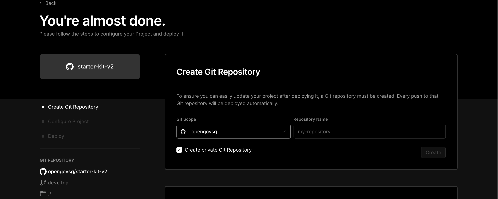
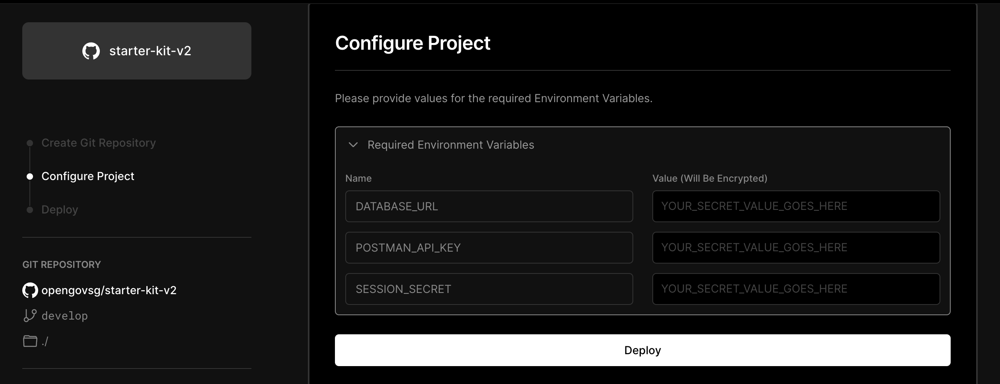
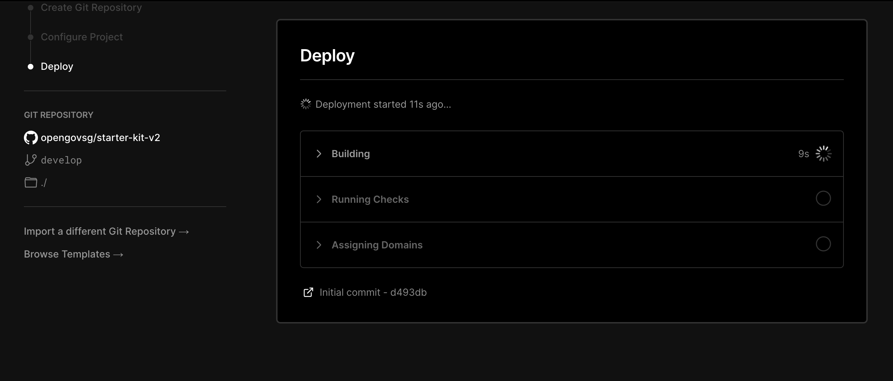

# Deploying your application

Starter Kit uses [Vercel](https://vercel.com) as our deployment platform. Vercel provides hosting for web applications, and offers a range of tools to aid with maintaining your product, including integrations with GitHub.

Setting up Vercel for your product can be done via the deploy button:

## Step 1: Creating your repository

Vercel will prompt you for a name to create a new GitHub repository. This will create a copy of the Starter Kit code base in your chosen location.

Once you have chosen a name, click Create.

## Step 2: Configuring your project

Once your repository has been created, you will need to provide the required set of environment variables.

The environment variables required are:

| Name              | What It Is                                                                                                                          |
| ----------------- | ----------------------------------------------------------------------------------------------------------------------------------- |
| `DATABASE_URL`    | The connection string for your database. This should have been obtained from CockroachDB.                                           |
| `POSTMAN_API_KEY` | An API key to send email via Postman                                                                                                |
| `SESSION_SECRET`  | A sequence of random characters used to protect session identifiers, generated by running the command `npx uuid` from your terminal |

## Step 3: Deploying

Click on Deploy and your copy of Starter Kit will start to deploy. Once the deployment has completed, you will be able to access your application at the Vercel URL.

