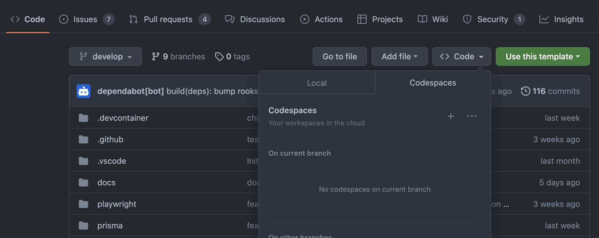
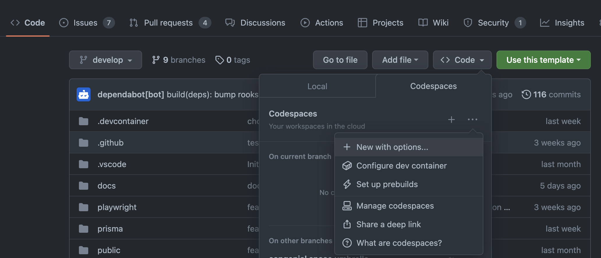
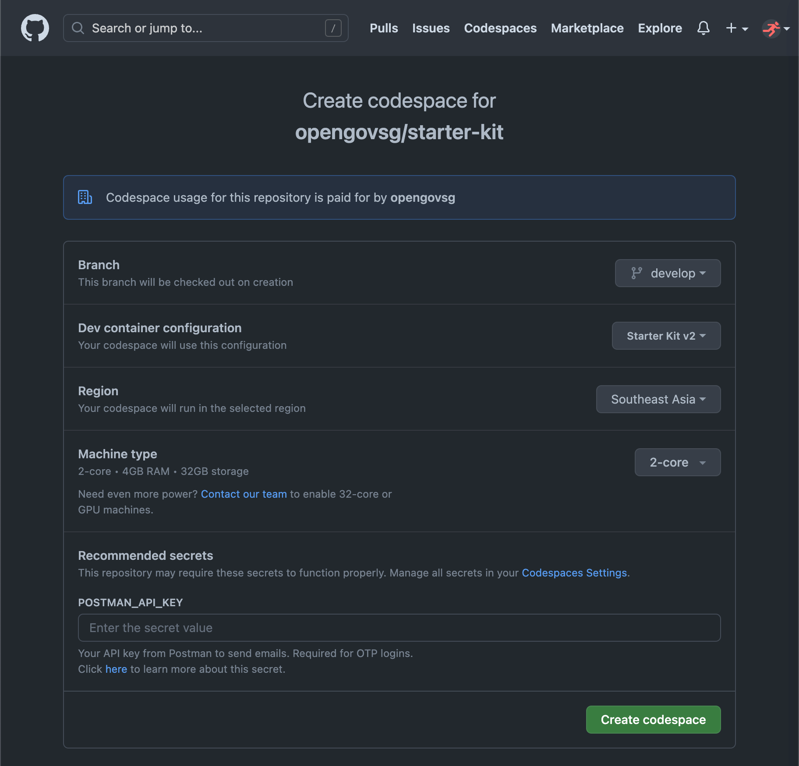
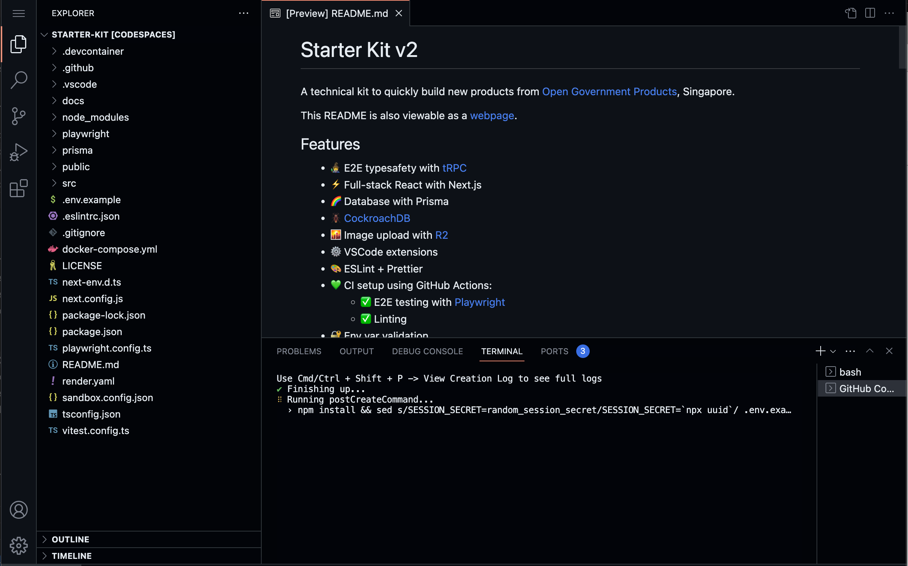
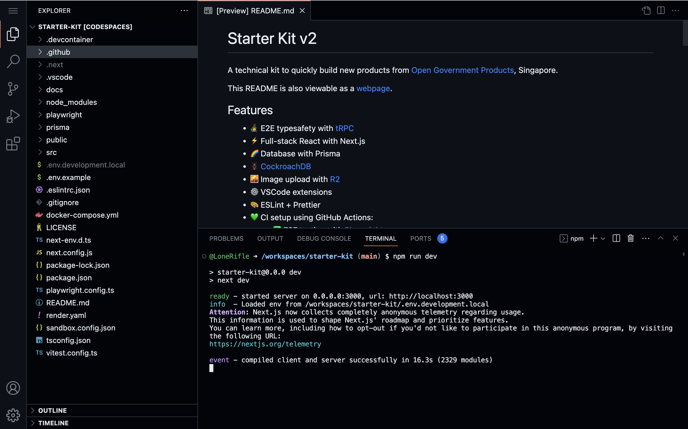
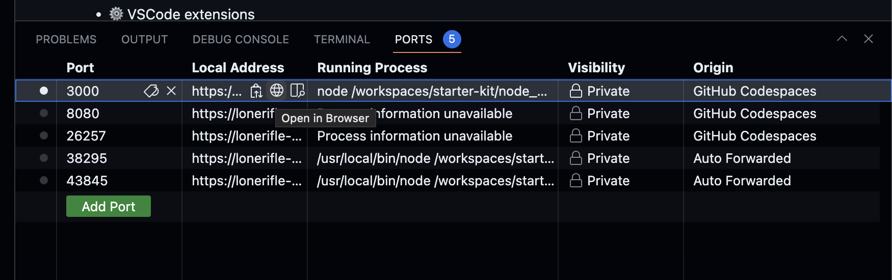
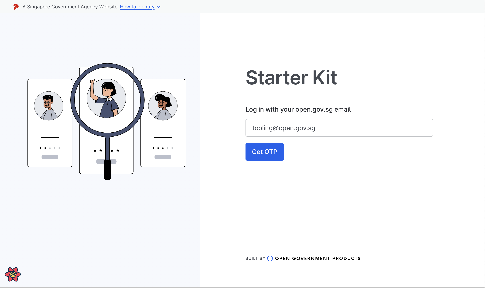
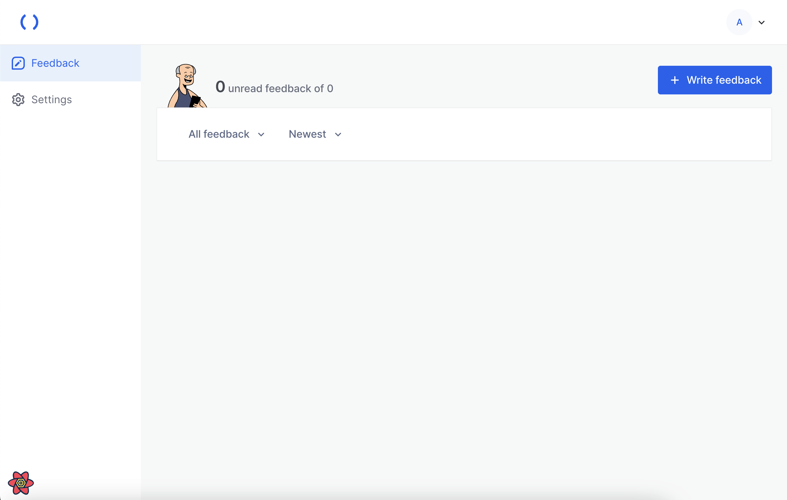

# Developing with Codespaces

To ensure a consistent developer experience, we encourage the use of [GitHub Codespaces](https://github.com/features/codespaces), an in-browser coding environment built around Visual Studio Code.

:::note
Developers who are more familiar working on their local machine can adapt the instructions here to suit their own set-ups.
:::

## Step 1: Launch a Codespace

Using your browser, navigate to GitHub repository you have created in the previous section
and select Code > Codespaces.

Click or tap on the three dots, and select "New with options...".

In the following screen, GitHub may prompt you to supply an API key for Postman,
if you have not done so previously. This is to grant the Codespaces you create the
ability to interact with Postman to send emails.

Wait for the post-create command to finish, and to be presented with a terminal. You will then be presented with Visual Studio Code running in your browser.

## Step 2: Start the development server

Verify that your set up is complete by typing `npm run dev` into the terminal,
and wait for your application to be built.

## Step 3: Access your application

Click the ports tab in the bottom pane. Find port 3000, and click the globe
to Open in Browser.

Your application should load, showing the login page. Attempt to log in
by using your email and entering the OTP that subsequently gets sent.

You may have to wait for a while as the next screen gets compiled before
loading. Verify that you have successfully logged in by confirming that
this screen:

