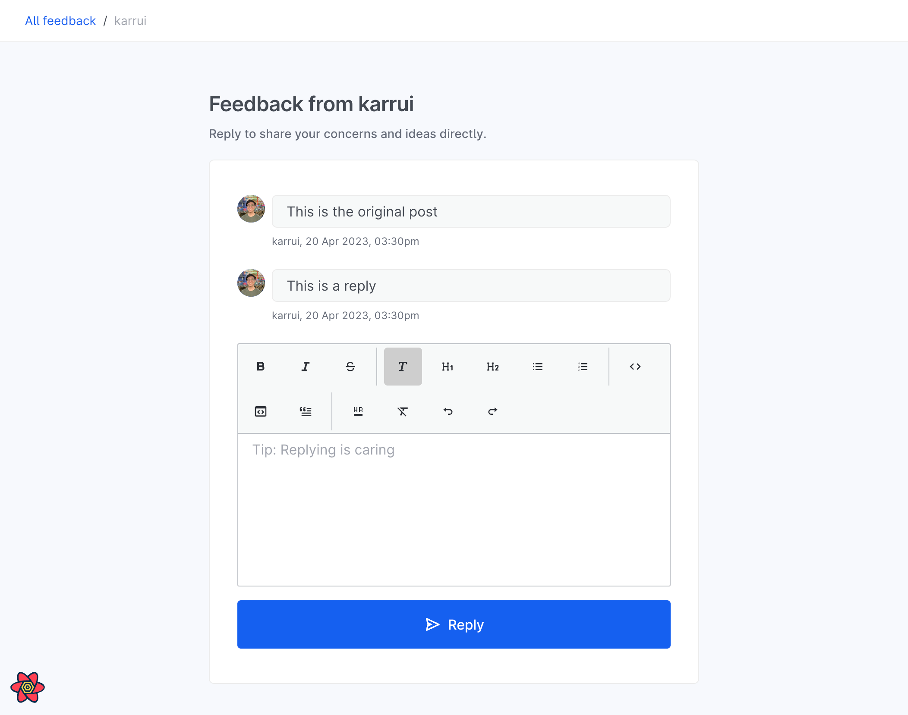

# Overview

:::note
This feature is already in the application, but here as documentation on how one could approach the problem.
If you want to follow along, you can check out the [`tutorial branch`](https://github.com/opengovsg/starter-kit-v2/tree/tutorial) that does not have this feature yet to follow along. Needed changes are marked with `TODO(example)`, or you may see the commit history for the changes needed.
:::note

There are usually 3 main parts to adding a feature:

- Making schema changes to the database (if needed)
- Updating application tRPC routers ("backend" code)
- Using new procedure in the application ("frontend" code)

This document will describe the flow of adding such a feature to the application.

### Refresher

As a refresher, this application uses the the following technologies and frameworks:

- [Next.js](https://nextjs.org/) for the React framework
  - A lightly opinionated, heavily optimised framework for building React applications without requiring a separate backend.
- [tRPC](https://trpc.io/) for the application API layer
  - Allows end-to-end typesafe APIs, with a focus on developer experience.
- [Prisma](https://www.prisma.io/) for the database ORM
  - A database toolkit that allows for easy database schema migrations, and a typesafe database client. Works extremely well with tRPC.

## What we will be implementing

There will be mainly changes to the following files:

1. `prisma/schema.prisma`
   - to add new fields to the `Post` model to accommodate replies
2. `src/server/modules/thread/thread.router.ts`
   - to add a new `reply` procedure

There will also be new components to allow for the client to invoke the new procedure.
