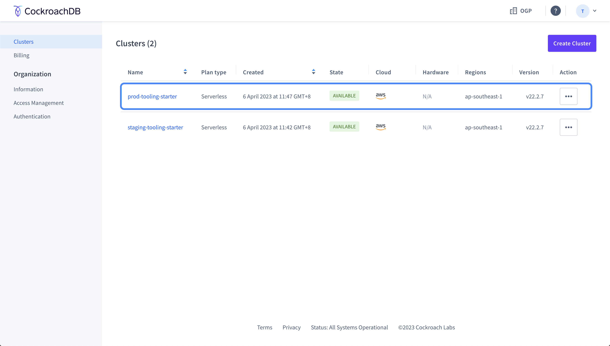
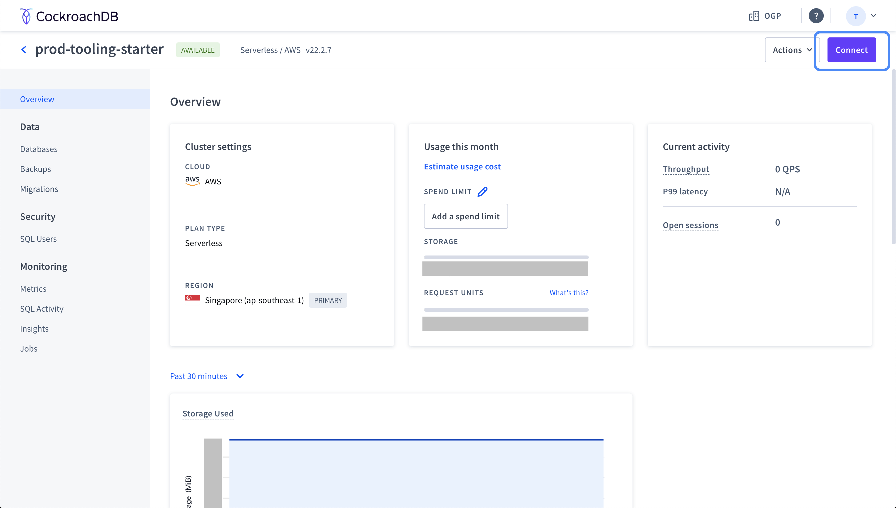
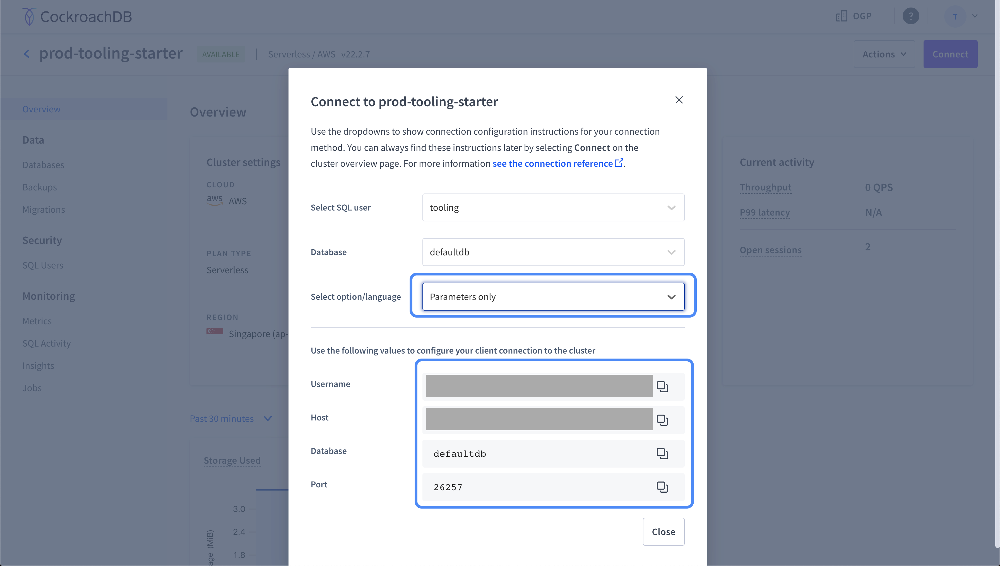

# Connecting to CockroachDB

## TablePlus
[TablePlus](https://tableplus.com/) can be used to connect to your CockroachDB instance to run queries.

### Development cluster
For connecting to your development instance of CockroachDB, you can use the following configuration:

| Field | Value | 
|:----- | :---- |
| Host/Socket | `localhost` |
| Port | `26257` |
| User | `root` |
| Password | `root` |
| Database | `app` |

### CockroachDB Cloud cluster
For connecting to your staging or production cluster running on CockroachDB Cloud, you will have to first login to your CockroachDB Cloud console and select the cluster you would like to access.

Next, click on the "Connect" button.

Select "Parameters only" under "Select option/language".

Next provide the following values to your TablePlus connection configuration:

| Field | Value |
|:----- | :---- |
| Host/Socket | Use the value provided under `Host` on the console |
| Port | Use the value provided under `Port` on the console |
| User | Use the value provided under `Username` on the console |
| Password | This value should have been set when you first created the database |
| Database | The format of the database name is as follow `<cluster_name>.<database_name>`.    The cluster name can be found in your `Host` value. For example, if your host is `prod-tooling-starter-1234.1ab.cockroachlabs.cloud`, your cluster name is `prod-tooling-starter-1234`. Your database name should be `prod-tooling-starter-1234.defaultdb`, assuming that your database name is `defaultdb`. |
