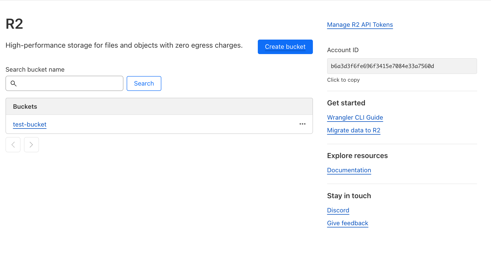
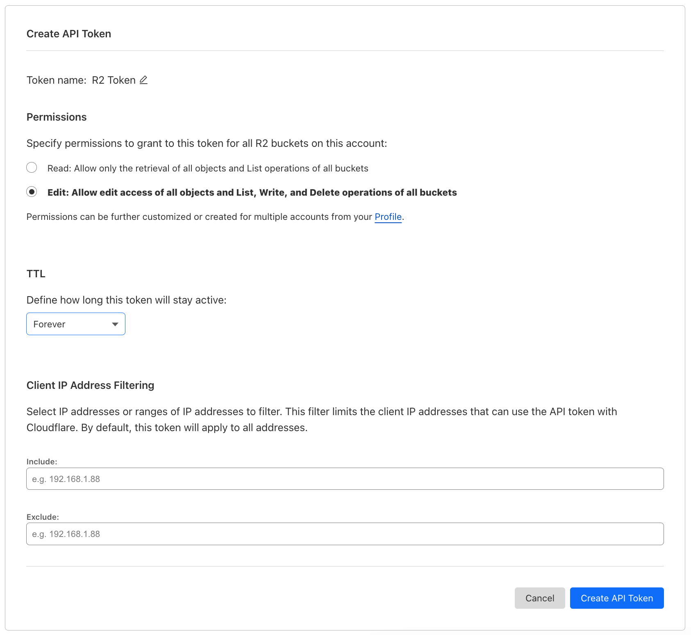
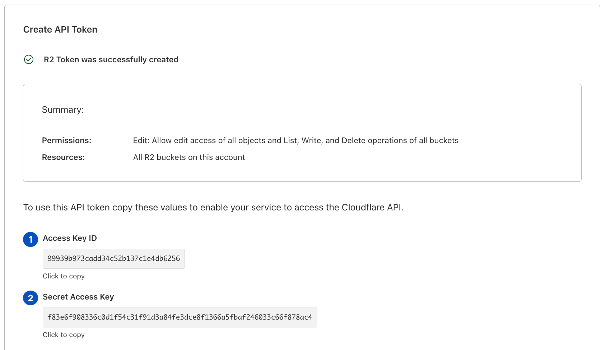
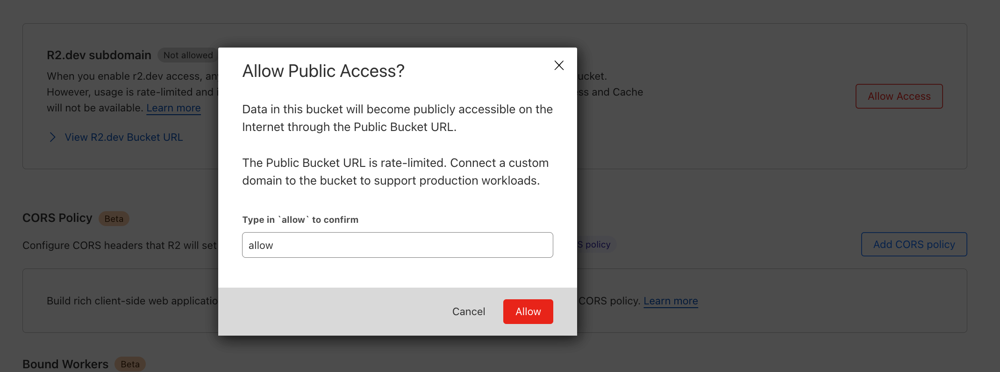
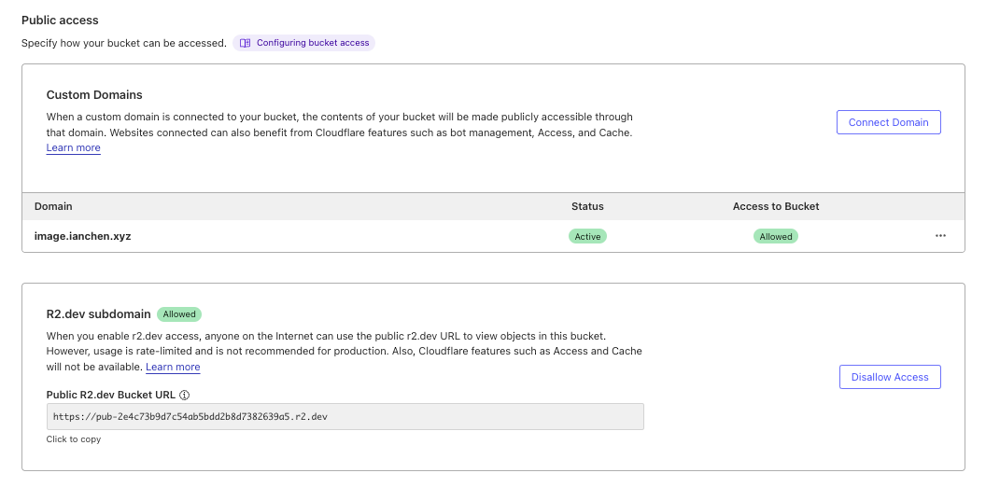
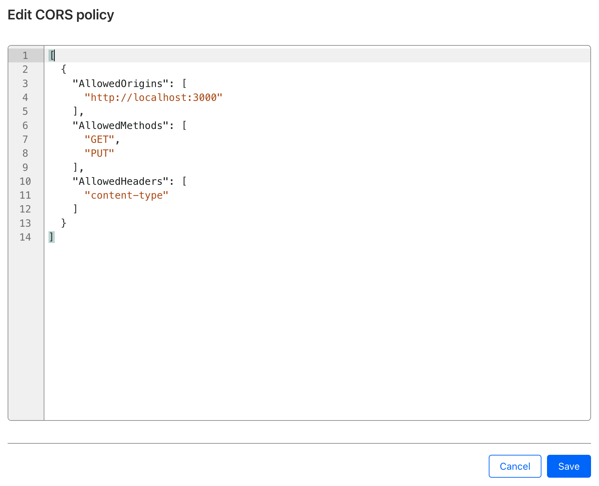

# Storage

To enable storage, which is in Starter Kit to enable image and avatar uploads, set the environment variable `NEXT_PUBLIC_ENABLE_STORAGE` to true.
There are also a few other environment variables that need to be set. See the [Required Environment Variables](#required-environment-variables) section for more details.

Starter Kit uses [Cloudflare R2](https://developers.cloudflare.com/r2/get-started/) as the storage layer, which is an AWS S3 compatible storage layer provided by Cloudflare.

## SaaS setup

To set up Cloudflare R2, follow the steps below:

1. Copy Account ID and create a bucket.
   
2. Create API Token with edit access. (Warning: this api token applies to all buckets)
   
3. Copy api key and secret
   
4. Allow public edit access to the bucket
   
5. Set custom domain for the bucket (optional for development)
   
6. Set CORS to allow for your domain, and update `AllowedHeaders` to include `content-type`
   

## Required environment variables

Set the following environment variables:

| Variable               | Description                                                                   |
| ---------------------- | ----------------------------------------------------------------------------- |
| `R2_ACCOUNT_ID`        | Your Cloudflare Account ID                                                    |
| `R2_BUCKET_NAME`       | Your Cloudflare Bucket Name                                                   |
| `R2_ACCESS_KEY_ID`     | R2 Access Key ID                                                              |
| `R2_SECRET_ACCESS_KEY` | R2 Secret Access Key                                                          |
| `R2_PUBLIC_HOSTNAME`   | Your custom/dev public subdomain e.g. `image.example.com`                     |
| `R2_AVATARS_DIRECTORY` | The subdirectory to store uploaded avatars in the R2 bucket `R2_BUCKET_NAME`. |
| `R2_IMAGES_DIRECTORY`  | The subdirectory to store uploaded images in the R2 bucket `R2_BUCKET_NAME`.  |

:::info
Read more about how environment variables are validated and used in [Environment Variables](/docs/concepts/08-env-variables.md).
:::
