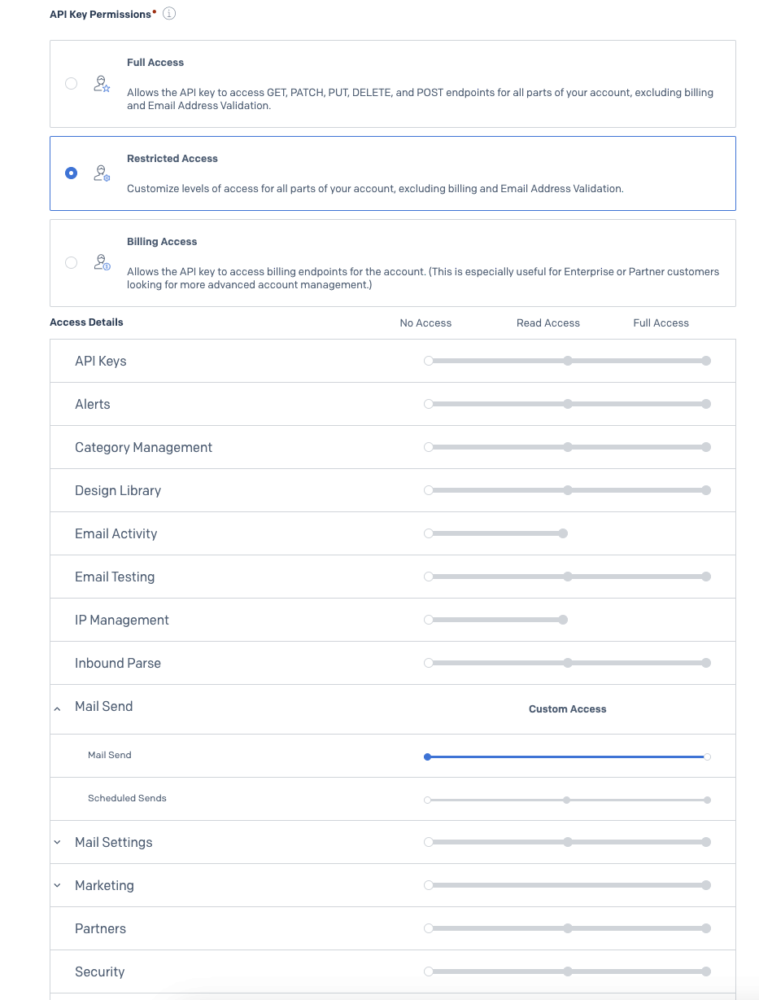

# Using Sendgrid instead of Postman for sending mail

If you do not have access to Postman, the application has also been configured to use Sendgrid to send emails. To use Sendgrid instead of Postman, follow the steps below:

## Quick setup

1. Sign up for a Sendgrid account [here](https://signup.sendgrid.com/).
2. Create an API key [here](https://app.sendgrid.com/settings/api_keys), only allowing Mail Send permissions.
   
3. Verify email to use as sender [here](https://app.sendgrid.com/settings/sender_auth/senders).
   - To comply with Sendgrid's (and US anti-spam laws) policies, you will need to provide a valid physical address. You can use the address of your company's office, or your home address.
   - Note the email you verified, as you will need it in step 4, and will be used as the `from` and `reply_to` portions of an email.
4. Add the following environment variables to your `.env` file:
   - `SENDGRID_API_KEY`: The API key you created in step 2.
   - `SENDGRID_FROM_EMAIL`: The email you verified in step 3.

:::info
Check out Sendgrid's documentation [here](https://sendgrid.com/docs/for-developers/sending-email/quickstart-nodejs/) for the full documentation. The code has already been set up in the application and can be found at [`lib/mail.ts`](https://github.com/opengovsg/starter-kit/blob/main/src/lib/mail.ts)
:::
