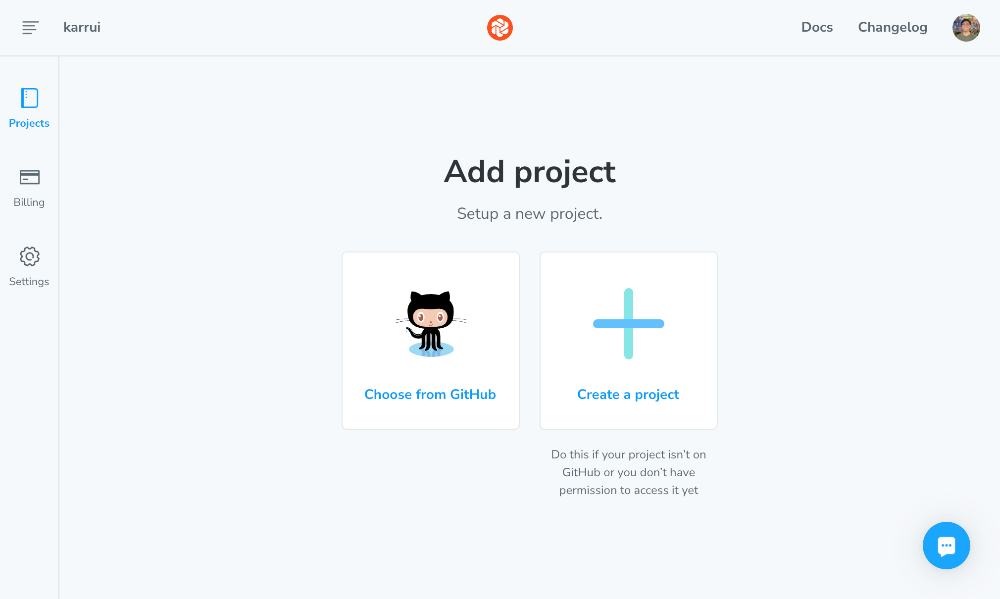
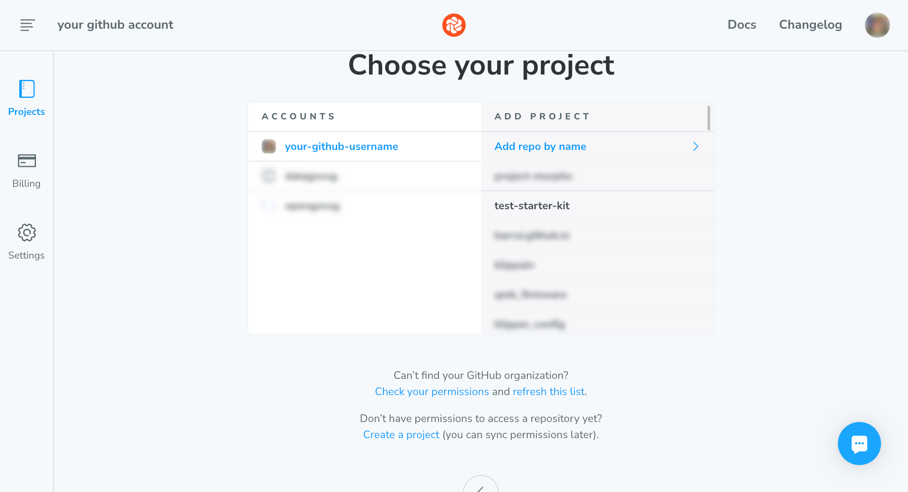
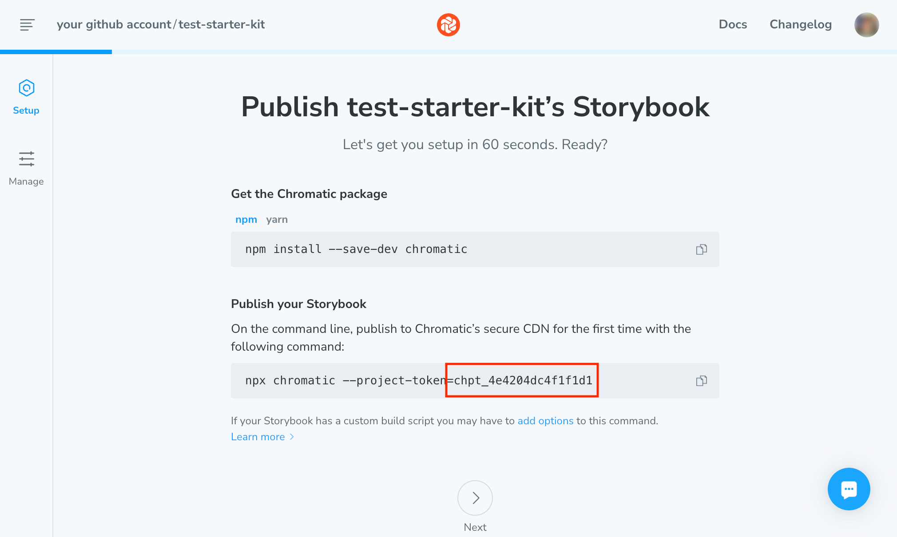
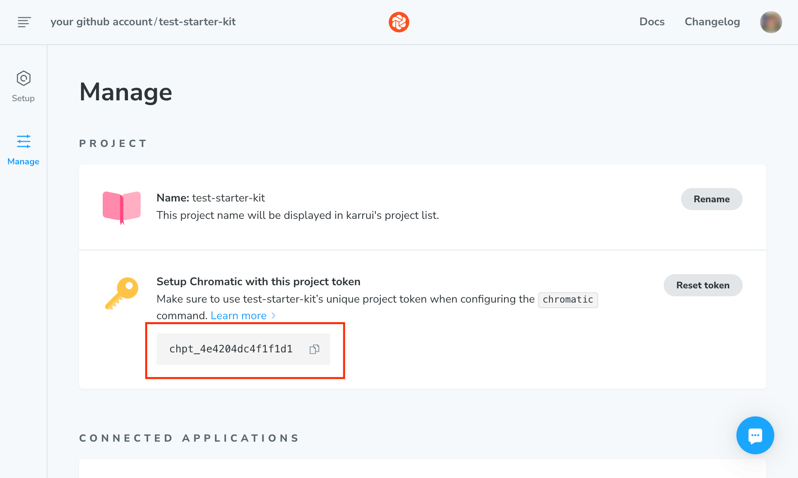
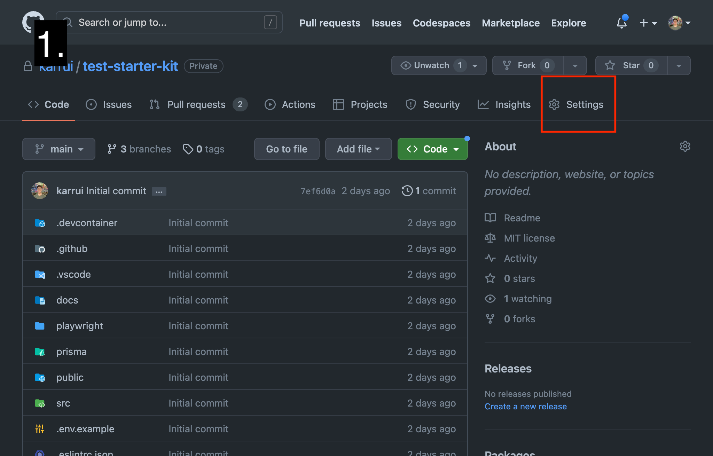
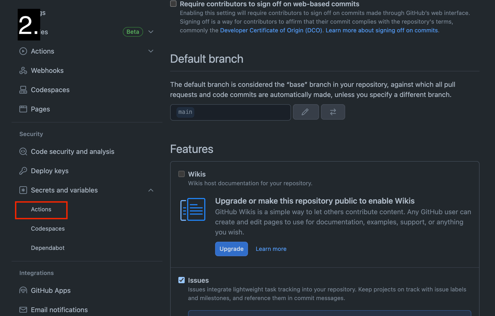
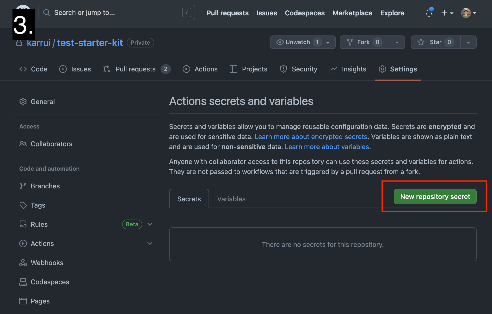
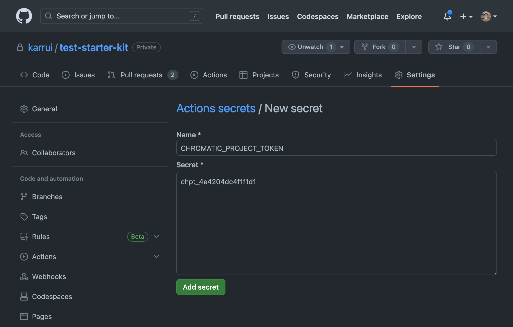

# Chromatic CI/CD workflow

This workflow runs on every pull request and pushes to main branches, but only if the `CHROMATIC_PROJECT_TOKEN` secret is set up in the repository. This workflow is responsible for running the visual regression tests using Chromatic, a software as a service that integrates with Storybook to detect visual changes in the UI components and pages.

:::note
Find out more about what Chromatic is and does [here](https://www.chromatic.com/).
:::

## SaaS setup

Chromatic has a robust free plan that allows for 5000 free snapshots per month, which should be sufficient for the prototyping phase.

To minimise unnecessary snapshots, the workflow only runs on any pull requests, or pushes to the `main` branch. This means that the workflow will not run on pushes to feature branches, and will only run on pushes to the main branch if the pull request has already been merged.

[Turbosnap](https://www.chromatic.com/docs/turbosnap) is also enabled, which means that Chromatic will only take snapshots of the pages/components that have changed, instead of all of them.

The settings for the workflow can be found in `.github/workflows/chromatic.yml`.

### Prerequisites

The project you want to connect to Chromatic should already be on GitHub.

### Set up

To set up Chromatic, follow the steps below:

1. Sign up/sign in to Chromatic [here](https://www.chromatic.com/start) with your GitHub account and add a project by clicking on "Choose from GitHub".
   
2. Choose the repository you want to connect to Chromatic.
   
3. You do not need to follow the steps outlined on the next page. The only important step is the project token, which is displayed in the page, or can also be found in the project settings:
   
   
4. Go to the GitHub repository secrets page, by going to Settings > Security/Secrets and variables > Actions:
   
   
   
5. Add and save the `CHROMATIC_PROJECT_TOKEN` secret with the value of the project token obtained in step 3.
   

With this done, Chromatic should be set up and ready to use. The GitHub action should run on every pull request, and pushes to the `main` branches.
