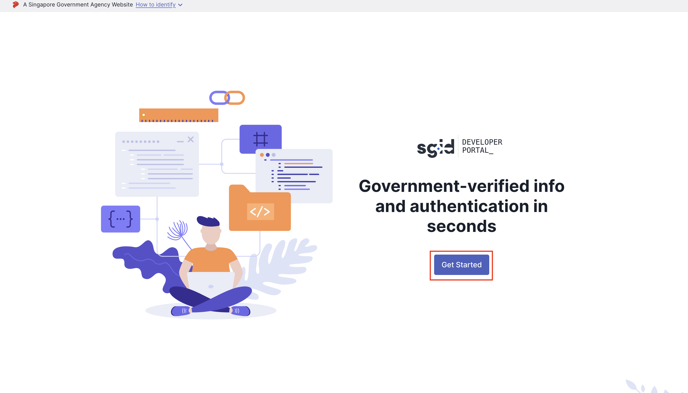
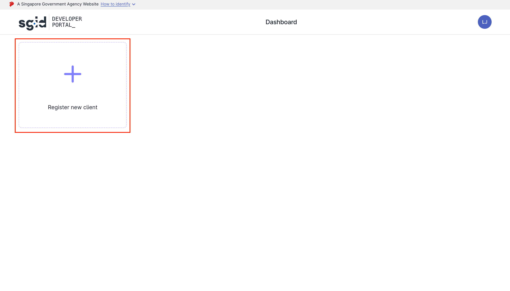

import ReactCompareImage from "react-compare-image";
import disabledEnv from "./images/sgid-login/disabled-env.png"
import enabledEnv from "./images/sgid-login/enabled-env.png"
import saveCreds from "./images/sgid-login/save-credentials.webp"

# SGID Login

To enable SGID Login, set the environment variable `NEXT_PUBLIC_ENABLE_SGID` to true.

When SGID log in is enabled, the log in page will have an additional SGID log in button.

<ReactCompareImage leftImage={disabledEnv} rightImage={enabledEnv} />
<figcaption align="center"><i>Left: disabled, right: enabled</i></figcaption>

# SGID setup

:::note
Check out the full [SGID documentation here](https://docs.id.gov.sg/introduction/overview).
:::

To set up SGID, follow the steps below:

1. Go to the [sgID Developer Portal](https://developer.id.gov.sg/) and log in with the Singpass mobile app.
   

2. Register a new client by clicking on the "Register new client" button.
   

3. Fill in the following details of your application.
   :::info
   The following values are for demonstration purposes only, please fill in the actual values for your application.

   The SGID scopes `openid myinfo.name myinfo.email` is required for the Starter Kit to work. If you are to request for more scopes, check out the [extending SGID scope](#extending-sgid-scope) section below.

   Redirect URLs have been set up in the application to be postfixed with `/sign-in/sgid/callback` due to client side redirection. When adding your own redirect URL, ensure that it is postfixed with that path.
   :::

   | Field         | Description                                                                                                                                                                                                                                                                                   | Value                                                  |
   | ------------- | --------------------------------------------------------------------------------------------------------------------------------------------------------------------------------------------------------------------------------------------------------------------------------------------- | ------------------------------------------------------ |
   | Name          | Your client display name.   This will be displayed to the end user when they are logging in to your app with the Singpass mobile app.                                                                                                                                                     | `Starter Kit`                                          |
   | Description   | A brief description of the purpose of your client application.   This will be displayed to the end user when they are logging in to your app with the Singpass mobile app.                                                                                                                | `This is to allow logging in with SGID on Starter Kit` |
   | Scopes        | The maximum list of [scopes](https://oauth.net/2/scope/) that your app will be authorized to access. Please refer to the [Data Catalog](https://docs.id.gov.sg/data-catalog) for the full list of scopes offered by sgID.                                                                     | `openid myinfo.name myinfo.email`                      |
   | Redirect URLs | The redirect URLs that sgID will be allowed to redirect to after the end user authenticates with the Singpass mobile app.   This should be the endpoint of your own application. You may need to add URLs on an adhoc basis for testing on generated URLs on Vercel preview deployments. | `http://localhost:3000/sign-in/sgid/callback`          |

4. Download the client credentials

   :::caution
   The client secret is only shown once. Please download the client credentials and store them securely.
   :::

   After completing registration, your client credentials will be generated. Download these credentials and store them in a safe place.
   

From the generated credentials, set the following environment variables accordingly. The variable keys should match the generated keys exactly:

- `SGID_CLIENT_ID`
- `SGID_CLIENT_SECRET`
- `SGID_PRIVATE_KEY`
- `SGID_REDIRECT_URI`: This should be the same as the redirect URL you have set up in the sgID Developer Portal.

## Extending SGID scope

If you increase the scope requested, you will need to update the exported `SgidUserInfo` type in [`src/server/modules/auth/sgid/sgid.utils.ts`](https://github.com/opengovsg/starter-kit/blob/develop/src/server/modules/auth/sgid/sgid.utils.ts#L11) to fit the new scopes.
